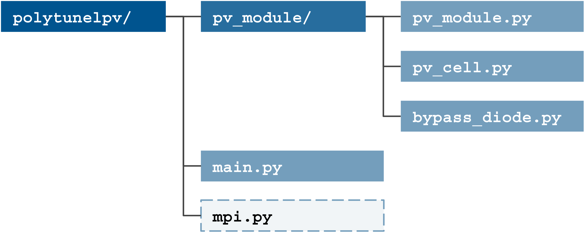

#  Design specification

The design specification for the Polytunnel-PV module.

#### Table Of Contents

1. [Problem definition](#problem-definition)
2. [Design considerations](#2-design-considerations)
3. [Functional structure](#3-functional-structure)
    1. [PV module component](#31-pv-module-component)
    2. [Parallel processing](#32-parallel-processing)
4. [System flow](#4-system-flow)
    1. [Internal flow](#41-internal-flow)
5. [Data structures](#5-data-structures)
6. [Description of algorithms](#6-description-of-algorithms)
7. [Module-level design](#7-module-level-design)
8. [Interface design](#8-interface-design)
9. [Testing](#9-testing)

# 1 Problem definition

Simulating photovoltaic  (PV) modules on flat surfaces is well established, with packages such as `pvlib` providing functionality and open-source APIs for this to be carried out. For agricultural-PV (agri-PV) applications, curved surfaces, such as polytunnels, provide a good potential surface for the installation of PV modules. The topology of these surfaces means that the performance of modules is no longer a simple calculation as each cell within the PV modules receives a different amount of sunlight, and is exposed to different environmental conditions. Hence, a new approach is needed in order to model these solar modules.

# 2 Design considerations

The code should be structured in such a way to provide

* An object, the `CurvedPVModule`, which represents such a module. This can be exposed, and provide APIs which enable other applications (such as [CLOVER](https://github.com/CLOVER-energy/CLOVER)) to model the performance of these modules. The code should also function in such a way as to enable parallel processing and mapping functions to compute the performance of these `CurvedPVModule` instances over a range of conditions;
* The code should utilise `PVCell` instances, which represent individual cells. The design should hence be that each cell's performance can also be computed in a parallel fashion;
* The configuration of the arrangement of bypass diodes within a `CurvedPVModule` should be easily adjustable and optimisable, potentially through an input file which contains information about the position of the bypass diodes/which cells are bypassed.

# 3 Functional structure

The code will be structured with a single component, responsible for simulating the PV module perofrmance, along with a separate `main.py` file for the running of the code. This is shown in [Figure 1](#fig_1).

**<a id="fig_1">Figure 1.</a> Functional structure of Polytunnel-PV.** The code is structured into a `pv_module` component, which handles the modelling of the `CurvedPVModule` class through both `pv_module.py` and, for the cells, `pv_cell.py`. `main.py` is responsible for the main execution of the code, with `mpi.py` or a similar parallel package being implemented to allow for fast parallel simulation.

# 3.1 PV module component

The component for the PV module will simulate the performance of the curved PV module. It will contain a Python module for simulating the performance of an individual solar cell, `pv_cell.py`, as well as a module for simulating the overall module performance, `pv_module.py`. Bypass diodes, due to their need to be included as an aspect of the overall module, are here given their own Python module, `bypass_diode.py`.

# 3.2 Parallel processing

Parallel processing can be easily implemented due to the physical structure of these devices. The IV curve for an individual cell doesn't depend on that of the other cells, only on its individual environmental conditions. Hence, the IV curve for each cell can be easily parallelised.

Once the cells have been assembled and computed, the overall performance of a PV module depends on the IV curve characteristics of each cell. This means that any computation of the IV cell curves blocks the computation of the overall performance which can only be carried out once each curve has been computed.

A user will likely wish to assess the performance of curved PV modules across a range of different conditions, whether environmental (_e.g._, solar irradiance) or design (_e.g._, bypass-diode configuration). Parallelising this functionality will enable the code to quickly compute different design and operation parameters quickly, enabling fast optimisations. An `mpi.py` file, or a similar parallelisable code framework, will help improve the code speed.

# 4 System flow

A user can enter either by calling `main` (_i.e._, calling the code directly) or by importing a data structure and calling APIs on it.

## 4.1 Internal flow

If a user calls `main`, the code will determine what type of run the user is trying to carry out: whether they are attempting to simulate the performance of a module across one set of conditions, across several conditions, or run an optimisation across a range of parameter values. The code will parallelise if necessary, calling out to the paralleliser module. If running a single simulation, then no call is needed.

The `pv_module` component will then be called. This will then simulate the performance of the module, calling out to the `PVCell` instances provided by `pv_cell.py` to determine the IV curve for each cell, and then determining the overall module performance from here. This will then return back up, to either `main` or the parallel processor, with the results of the computation.

# 5 Data structures

`CurvedPVModule` will contain the functionality of the curved PV module:
* `pv_cells` will contain all of the `PVCell` instances contained within the module;
* `bypass_diodes` will contain all of the `BypassDiode` instances contained within the module;
* `length`, `width`, `axis_of_curvature` will be parameters that govern the geometry of the module.

`PVCell` will contain the functionality of the PV cells:
* `curve_parameters` will contain parameters that govern the IV curve of the cell. **NOTE**, the cell parameters may be defined as individual attributes on the cell or as a `dict` which contains all of the parameters;
* `width`, `length`, `tilt` and `azimuth` will govern the geometry of the cell.

# 6 Description of algorithms

TBC.

# 7 Module-level design

The `CurvedPVModule` will have an exposed method for determining the performance of the module. It will provide for the configuration of bypass diodes to be passed in as a list of bypass diodes associated with the module. In this way, the bypass diodes can be configured separately.

The `PVCell` will have an exposed method for determining the IV curve of the cell based on the irradiance and cell position. Cell angles will be dynamically determined based on their index within the module (taking a linear arrangement) and the overall module geometry.

# 8 Interface design

The command-line interface (CLI) should enable a user to
* Select which module they would like to investigate, with the module parameters, along with the bypass-diode configuration, defined in a name input file;
* Select what range of parameters they would like investigated and modelled together, by either specifying a range in a file (as will be the case for the more-complex configuration of bypass diodes) or by providing it on the CLI or passing it through to the program via an API.

# 9 Testing

The performance of each function will be tested to ensure as close to 100% code coverage as possible.
